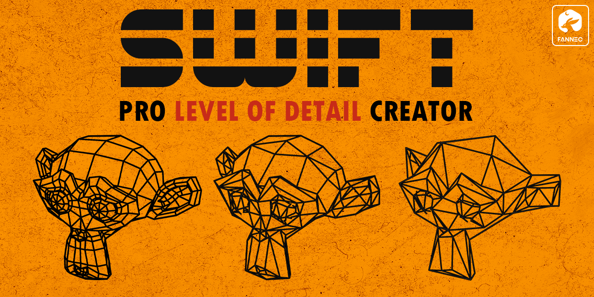

Modular Suburban House Creator
=============

**SwiftLOD** is a one-click LOD creation addon for Blender, featuring an easy-to-use Preset System. Save time by automatically generating LODs for your models and exporting them directly to Unity and Unreal.

Features
--------

* **One-Click LOD Generation**: Instantly create multiple LOD levels with adjustable reduction settings.
* **Preset System**: Save and reuse your favorite LOD configurations for different projects.
* **Direct Engine Export**: Seamlessly export LODs for Unity & Unreal Engine with correct naming conventions.
* **Batch Processing**: Generate LODs for multiple objects at once.
* **Clean Scene Management**: Automatic LOD collections keep your workspace organized.

Support
-------

If you have any questions get in touch via :doc:`contact`.

Contents
--------

.. toctree::
   :maxdepth: 2

   installation
   tools
   changelog
   contact
